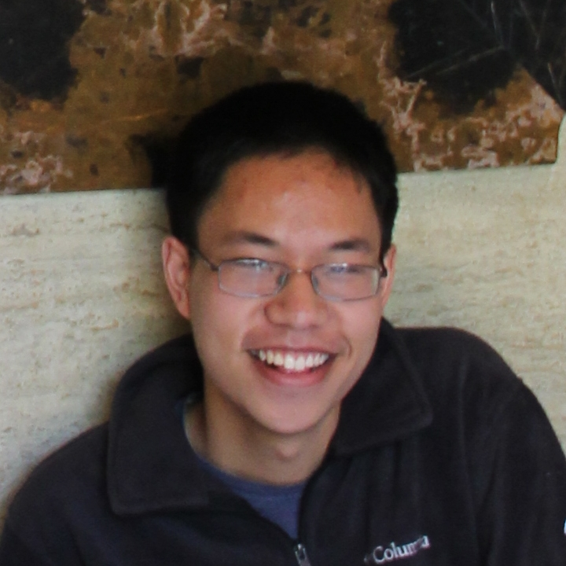

---
# You don't need to edit this file, it's empty on purpose.
# Edit theme's home layout instead if you wanna make some changes
# See: https://jekyllrb.com/docs/themes/#overriding-theme-defaults
layout: home
---
I am a first year PhD student at the University of Michigan.

I'm interested in the intersections of HCI + ML.
I'm actively doing research with [Prof. Walter Lasecki](https://web.eecs.umich.edu/~wlasecki/)
and [Prof. Honglak Lee](https://web.eecs.umich.edu/~honglak/).

Updated Jan. 2020.
